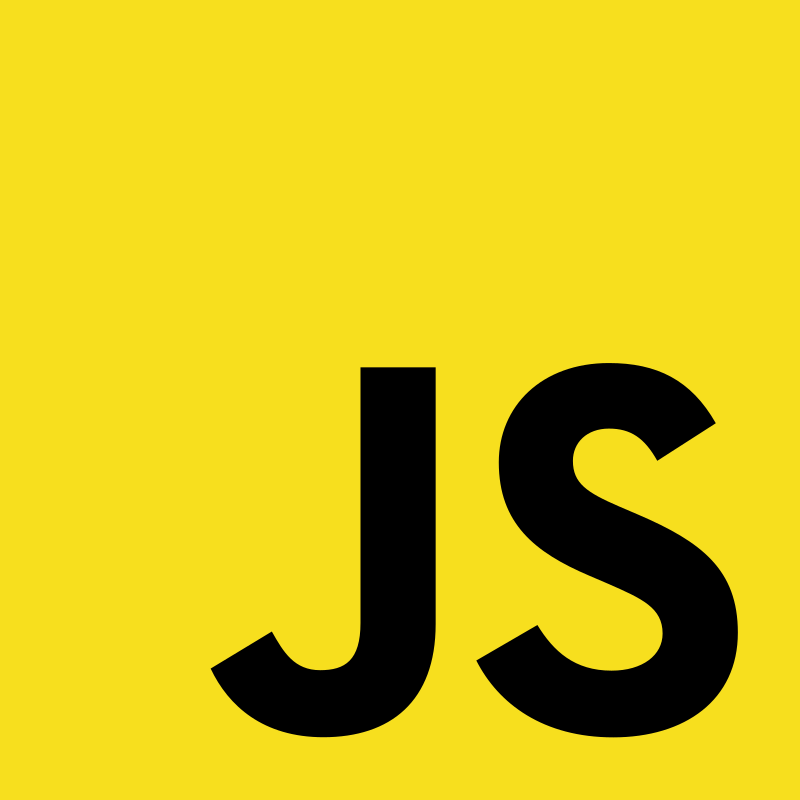

<h1> Hi there, I am Mahmut 👋</h1>

I am a Software Enginner and Unofficial Audio Engineer.

As a sound engineer, I am experienced in the use of many professional daw.
<h2>The daws I use :</h2>

<h2>The programming languages I use :</h2>

